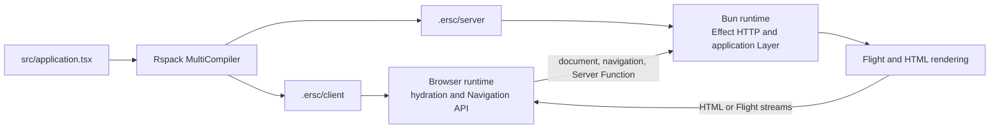

# Architecture

Current implementation overview. Accepted future work is in [DECISIONS.md](DECISIONS.md); unresolved
choices are in [OPEN_QUESTIONS.md](OPEN_QUESTIONS.md).

## Runtime topology



Only protocol values cross runtime boundaries: compiled application exports, asset and reference
metadata, HTTP, HTML, and Flight. Browser code does not import server or build entries. Only the RSC
graph resolves React's `react-server` condition.

## Runtime graphs

```text
packages/effective-rsc/src/
  application/  public authoring factories and application definition
  rsc/          shared Flight contracts
  client/       hydration, navigation, and browser rendering
  server/       HTTP, RSC, SSR, and request lifetimes
  build/        Rspack lifecycle and compiled-server loading
```

Details:

- [Build and runtime graphs](architecture/build.md)
- [Authoring and route model](architecture/authoring.md)
- [Request flows](architecture/request-flows.md)
- [Lifetimes, failures, and protocols](architecture/lifetimes-and-protocols.md)
- [Client-router lifecycle](architecture/client-router.md)

## Boundaries

- `effective-rsc` exposes its authoring API only under the `react-server` condition and throws in
  other runtimes. Types remain unconditional.
- `effective-rsc/server` exposes Bun startup; `effective-rsc/build` exports adapter contract types.
  `effective-rsc/client` exports query/stream helpers and Server Function errors;
  `effective-rsc/types` declares asset imports. Other runtime and build modules remain private.
- `src/application.tsx` is the only application filename with framework semantics.
- Generated application artifacts live under `.ersc/` and are consumed only through their generated
  entry points. Build hooks may package their supplied output directories without modifying them;
  the separate `@ersc/vercel` package owns `.vercel/output/`.
- React owns the RSC and Server Function protocols. ERSC adds Effect typing, validation, and
  lifetimes without replacing those transports.
- Applications own React `<ViewTransition>` boundaries and animation policy. ERSC publishes UI in
  React Transitions and supplies router transition types at that publication boundary.
- Effect owns application services, HTTP integration, resource scopes, and interruption.

## Known limitations

- **L003 — Server Function failure contract:** handlers and returned Streams require a `never`
  error channel. Expected application outcomes belong in success values. Browser calls expose
  `ServerFnInputError`, `ServerFnDefect`, or `ServerFnTransportError`; there is no per-function typed
  failure codec. This is the chosen ERSC contract (D-072), not a restriction imposed by React.
- **L004 — Progressive bound arguments:** arguments bound inside a Client Component do not
  progressively enhance without JavaScript; React does not serialize that client-created binding.

## Site, examples, and integration fixture

[`site`](../site) serves installed package docs through ERSC on Vercel. UI dependencies and
deployment-scoped CDN caching are site-owned; native streaming is unchanged. See
[site deployment](../site/README.md#deployment) for cache limits, including late stream errors.

[`examples/hello-world`](../examples/hello-world) is the introductory example for streaming,
hydration, navigation, and Server Functions. It is also the Bun deployment example for Vercel.
[`examples/event-platform`](../examples/event-platform) is the real-world product example.
[`examples/streaming-feed`](../examples/streaming-feed) demonstrates server-seeded atoms and
incremental Server Components read from SQLite and accumulated through a stream-backed atom.
[`fixtures/framework-e2e`](../fixtures/framework-e2e) is the neutral framework integration fixture;
its routes, data, artificial latency, and UI exist to expose protocol and lifecycle behavior.
