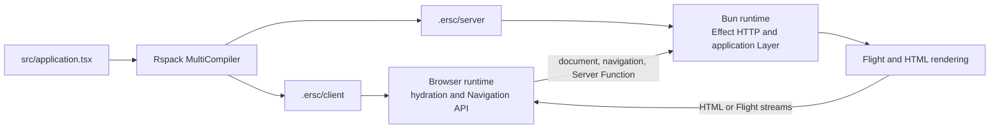

# Architecture

Current implementation overview. Accepted future work is in [DECISIONS.md](DECISIONS.md); unresolved
choices are in [OPEN_QUESTIONS.md](OPEN_QUESTIONS.md).

## Runtime topology



Only protocol values cross runtime boundaries: compiled application exports, asset and reference
metadata, HTTP, HTML, and Flight. Browser code does not import server or build entries. Only the RSC
graph resolves React's `react-server` condition.

## Runtime graphs

```text
packages/effective-rsc/src/
  application/  public authoring factories and application definition
  rsc/          shared Flight contracts
  client/       hydration, navigation, and browser rendering
  server/       HTTP, RSC, SSR, and request lifetimes
  build/        Rspack lifecycle and compiled-server loading
```

Details:

- [Build and runtime graphs](architecture/build.md)
- [Authoring and route model](architecture/authoring.md)
- [Request flows](architecture/request-flows.md)
- [Lifetimes, failures, and protocols](architecture/lifetimes-and-protocols.md)

## Boundaries

- `effective-rsc` exposes its authoring API only under the `react-server` condition and throws in
  other runtimes. Types remain unconditional.
- `src/application.tsx` is the only application filename with framework semantics.
- Generated application artifacts live under `.ersc/` and are consumed only through their generated
  entry points.
- React owns the RSC and Server Function protocols. ERSC adds Effect typing, validation, and
  lifetimes without replacing those transports.
- Effect owns application services, HTTP integration, resource scopes, and interruption.

## Known limitations

- **L002 — Page parameter rejection:** a matched Page's Schema failure has no settled mapping to
  NotFound or another expected HTTP outcome. See
  [OQ-003](OPEN_QUESTIONS.md#oq-003--route-parameter-schema-rejection).
- **L003 — Server Function failures:** the handler's typed Effect failure is not represented in the
  client Promise type. Expected failures should be encoded in the output. See
  [OQ-006](OPEN_QUESTIONS.md#oq-006--server-function-failure-channel).
- **L004 — Progressive bound arguments:** binding extra arguments to a Server Function inside a
  Client Component does not progressively enhance without JavaScript because the upstream React
  protocol does not serialize that client-created binding.

## Integration fixture

[`examples/kitchen-sink`](../examples/kitchen-sink) is the real-world conference application and
primary integration fixture.
