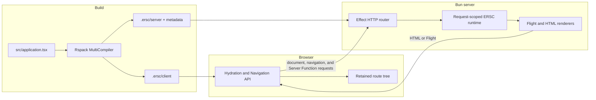
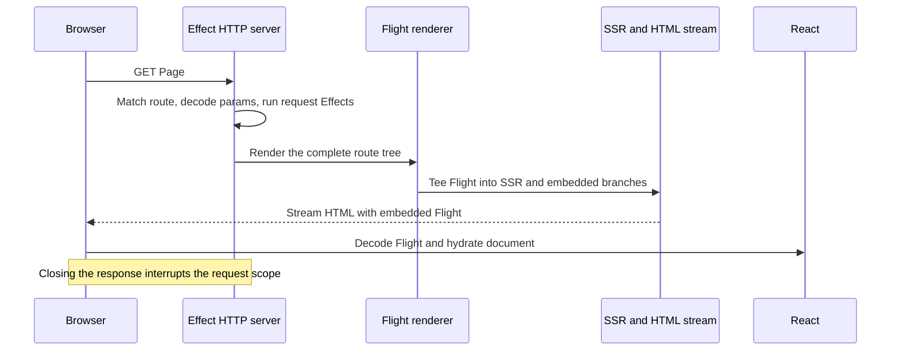
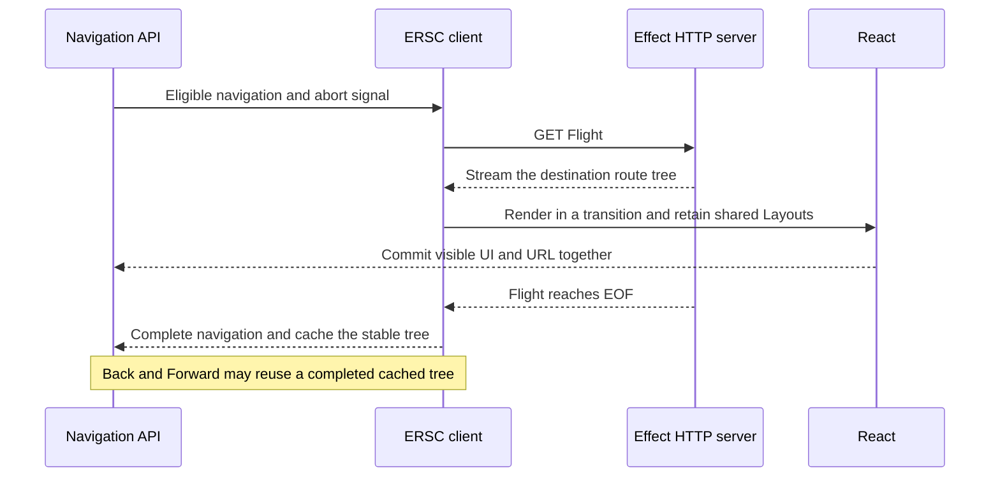
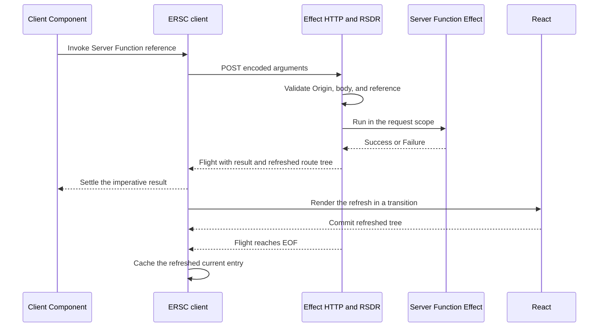
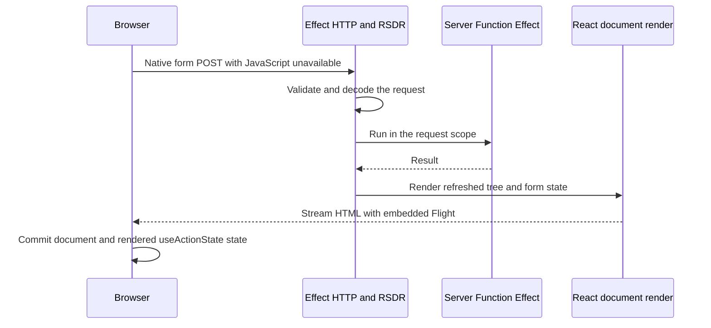

# Architecture

This document describes the current implementation. Accepted future work is marked **Planned** in
[DECISIONS.md](DECISIONS.md); unresolved choices belong in
[OPEN_QUESTIONS.md](OPEN_QUESTIONS.md).

## Runtime graphs

```text
packages/effective-rsc/src/
  application/  public factories and application definition
  rsc/          browser/server Flight contracts
  client/       hydration and Navigation API runtime
  server/       HTTP, RSC, SSR, and request scope
  build/        Rspack lifecycle and compiled-server loading

examples/kitchen-sink/  application example and integration fixture
```

`effective-rsc` exposes its root API under the `react-server` condition and throws if it executes
under another condition. Types remain unconditional. Application, protocol, browser, server, and
build graphs stay explicit: browser code never imports server or build entries, and only the RSC
graph resolves React's `react-server` condition.

The server owns HTTP negotiation, request scope, Flight rendering, HTML streaming, and Bun listening.
The client owns Flight decoding, document hydration, and navigation. The build graph owns application
compilation and compiled-server loading.

### Runtime topology

Read left to right: one application definition is compiled for the server and browser; HTTP and
streamed React protocols are the only runtime connection between them.



Only protocol values cross these boundaries: compiled application exports, asset and reference
metadata, HTTP, HTML bytes, and Flight bytes. Browser modules never import server or build entries;
the application root enters the RSC graph under the `react-server` condition. The server bundle may
contain RSC and SSR layers, but Rspack keeps their React conditions explicit.

Owning modules: [`build/rspack-config.ts`](../packages/effective-rsc/src/build/rspack-config.ts),
[`build/rsc-entry.ts`](../packages/effective-rsc/src/build/rsc-entry.ts),
[`server/application.ts`](../packages/effective-rsc/src/server/application.ts), and
[`client/entry.ts`](../packages/effective-rsc/src/client/entry.ts).

## Package and application builds

Rslib emits bundleless ESM, declarations, and source maps under `packages/effective-rsc/dist/`.
Published entries execute that JavaScript, preserve RSC directives and graph boundaries, and never
expose raw TypeScript. The package also ships its guides and a generated `LLMS.md`; tests type-check
the examples and reject stale generated documentation.

`ersc build` runs a direct Rspack MultiCompiler with paired browser and server configurations. Rspack's
native RSC plugins assign RSC/SSR layers, produce client-reference data, and coordinate assets. Output
lives under `.ersc/client/` and `.ersc/server/`; the framework does not generate proxy source files.

A checked-in `'use server-entry'` module imports the application through one private alias. Only
`src/application.tsx` has filename semantics. Rspack supplies ordered JavaScript and stylesheet
metadata to the compiled application; assets are not fields in the Flight model.

The browser build targets the Navigation API browser floor and enables the React Compiler. The server
build targets Bun's Node 26 compatibility and omits the React Compiler. React, React DOM, and RSDR use
one exact compatible release. The server build leaves `effect` and `@effect/*` imports external so Bun
loads the application's exact shared peers at runtime. This also preserves runtime-owned dynamic
imports, such as filesystem migration loading, instead of rewriting them into bundle contexts.
`bun:*` builtins stay external there too, while the browser build fails the compilation for any
`bun:*` or `@effect/platform-bun` request and names the boundary the import should move behind.

CSS stays in Rspack's native pipeline, including Tailwind CSS v4 through `@tailwindcss/webpack`.
Effect `HttpStaticServer` serves the application root's `public/` directory from `/` with
`Cache-Control: public, max-age=0`; compiler assets remain under `/_ersc/assets`.

Development preserves React's native Server Components Performance Tracks. Initial hydration uses
the document timeline origin; navigation and Server Function decoding receive a timestamp captured
immediately before Effect HTTP execution. Rspack removes this timing metadata from production. A
separate React Debug Channel transport remains deferred.

## Application model

`Application.ersc<Services>()` creates one application-scoped ERSC authoring module. It owns a service
universe, runtime identity, and request-runner context. Feature modules use its factories, then
`ERSC.make({ routes, layer })` closes the module into the executable application exported from
`src/application.tsx`.

| Value       | Role                                                                                  |
| ----------- | ------------------------------------------------------------------------------------- |
| `Page`      | Effectful route leaf.                                                                 |
| `Layout`    | Effectful route wrapper with one `children` outlet; the root owns the document shell. |
| `Loading`   | Synchronous, service-free fallback directly below its Layout.                         |
| `Component` | Effectful Server Component that is not a route concern.                               |
| `ServerFn`  | Promise-shaped native React reference backed by a lazy Effect on the server.          |
| `Routes`    | Immutable route graph with inherited Page HTTP middleware.                            |

Each operation infers requirements within `Services`; declaring the universe once preserves them
across JSX. `ERSC.make` receives its closed Layer, while service-free applications call
`Application.ersc()`. That Layer may also register native Effect HTTP routes, APIs, RPC, and global
middleware. The server builds it once, shares its services, and releases them at shutdown; request
Effects retain independent interruption lifetimes.

Every authored value carries its ERSC identity. Route composition rejects the wrong concern role or a
value from another ERSC instance. Server Functions retain that identity across native invocation and
execute only in the matching request runtime.

Concerns consumed directly by React stay callable branded functions: Layout, Loading, Component, and
ServerFn. ERSC-only values—Page, Routes, and Application—are opaque handles. Internal modules project
their runtime state through an accessor instead of exposing fields or maintaining a lookup registry.
Page stays opaque because authors compose it through Routes rather than render it directly.

Every ERSC value identifies itself by a `Symbol.for` brand, not by constructor identity, so a value
produced by a duplicated copy of the framework module still composes. Wiring mistakes then surface as
the ERSC identity error they are, rather than as a misleading claim that the value was never created
by the matching factory.

Each ERSC module owns an AsyncLocalStorage context for its request runner. Flight rendering binds one
FiberSet runner before React enters application code. Page, Layout, and Component operations retrieve
that runner without prop threading, while the FiberSet keeps their Effects attached to the HTTP
request lifetime.

Pages are explicit ERSC concerns with one ordinary parameter contract: `Page.make({ render })` is
static and `Page.make({ params, render })` retains the authored Effect Schema internally. The
parameterized Page's render operation receives decoded `params`, and Routes type-checks the Schema's
encoded object keys against the Page path parameters. Parameter Schemas must expose a finite,
non-empty key set whose encoded fields can accept strings; transformations may produce a different
decoded object for the render operation.

## Routes and Flight model

`Routes.make` builds immutable routes. `page(path, Page)` adds an Effect HTTP pattern;
`mount(prefix, routes)` mounts a non-empty same-ERSC graph. Nested routes may own Layout, Loading,
both, or neither; the root requires a Layout and at least one Page. Page paths own `:parameter`
segments, while mount prefixes remain parameter-free. Effect HTTP owns matcher syntax and selection.

Composition requires literal canonical paths and rejects invalid syntax, duplicates, empty mounts,
erased contracts, invalid concern combinations, and patterns overlapping `/_ersc/assets`. Patterns
differing only by parameter name or static-segment casing conflict because Effect HTTP matches them
identically. The compiler registers authored patterns directly; ERSC adds no second matcher.

Compilation flattens the graph into destinations containing the pattern, Page, middleware, and
Layout/Loading ancestry. Because a Routes value may be mounted under several prefixes, each
destination owns its ancestry and its Effect HTTP handler closes over it. Parameterized Pages decode
Effect HTTP captures with their Schema; parameter-free Pages avoid router context. One renderer
builds the unary tree:

```text
Layout -> optional Loading -> nested scope -> ... -> Page
```

Each Flight node contains an opaque React `id`, Server Component content, and an optional child. IDs
encode identity for reconciliation but are not parsed as protocol data. Every request still carries
one complete route tree; there is no partial patch transport. Unknown patterns retain Effect HTTP's
native `404`. Mapping a matched Page's Schema rejection to NotFound or another expected failure
remains open.

Routes middleware is an opaque same-ERSC ownership adapter over Effect `HttpRouter.Middleware`.
ERSC orders ancestors before descendants; Effect owns composition, reverse response unwinding, and
short-circuiting. Application Layer middleware surrounds the whole router. The exact reach of each
kind is recorded in [Middleware reach](#middleware-reach).

## Initial document



The browser makes no second initial Flight request and hydrates `document`, not a framework container.
Disconnecting cancels both stream branches and interrupts request-scoped Effects.

If Fizz fails before producing the HTML shell, `HtmlRenderError` reaches Effect HTTP and becomes an
empty `500` response. Once streaming begins, the status and headers are already committed. Fizz
reports subsequent render errors through the request's Effect logger, while React and Web Streams
own boundary recovery or stream termination. Expected request aborts are not logged as render
failures.

Owning modules: [`server/application.ts`](../packages/effective-rsc/src/server/application.ts),
[`server/flight-renderer.tsx`](../packages/effective-rsc/src/server/flight-renderer.tsx),
[`server/html-renderer.tsx`](../packages/effective-rsc/src/server/html-renderer.tsx), and
[`client/hydrate.ts`](../packages/effective-rsc/src/client/hydrate.ts).

## Client navigation

This is the successful fresh-request path. A cache hit skips the server request; cancellation and
supersession follow the outcome table below.



The router uses `window.navigation` without a History API fallback. When the Navigation API or
`NavigationPrecommitController` is missing, the browser entry stops before hydrating and leaves the
streamed document untouched, so the application degrades to a plain multi-page application: links
perform document navigations and forms post their Server Function natively. Client Components are
not interactive in that mode. Native focus and scroll remain enabled, and closing the browser Effect
scope removes the listener.

`NavigateEvent.signal` owns the Flight request and its child Effect scope. The precommit handler
settles at the exact Layout commit, while a post-commit handler keeps the browser navigation active
until the Flight stream reaches EOF. Cancellation interrupts the transport and request-scoped server
Effects, then restores the last stable route tree and history entry. A superseding navigation retires
the earlier response after its successor starts rendering without briefly restoring the previous UI.

The Flight payload carries the final request URL. After a followed redirect, cancelable navigation
uses `NavigationPrecommitController.redirect`; non-cancelable traversal uses `location.replace`.
Non-Flight or non-success navigation responses promote to a full-document navigation.

The browser retains the currently revealed common Layout prefix. It caches only completed whole-tree
navigation payloads by `NavigationHistoryEntry.id`; Back/Forward traversal reuses those payloads,
while pushes, replacements, and uncached traversals fetch Flight. Disposing a history entry evicts its
payload. A Server Function refresh invalidates the traversal cache and stores the refreshed current
entry because application mutations may affect other routes.

### Navigation outcomes

| Outcome               | Visible UI and history                                                     | Work lifetime                                      |
| --------------------- | -------------------------------------------------------------------------- | -------------------------------------------------- |
| Complete              | Destination remains committed                                              | Cache only after Flight EOF                        |
| Explicit cancellation | Restore the last stable route tree and history entry                       | Cancel the stream and interrupt server Effects     |
| Superseded            | Keep current UI until the successor commits; do not flash the stable route | Retire the earlier render after its successor wins |

History coordination and React rendering remain separate so rollback does not depend on incidental
render timing. After an abort, one task boundary lets the browser dispatch a superseding event before
ERSC decides whether to restore history; successful rendering and Flight completion are not delayed.

Owning modules: [`client/navigation-api.ts`](../packages/effective-rsc/src/client/navigation-api.ts),
[`client/navigation-coordinator.ts`](../packages/effective-rsc/src/client/navigation-coordinator.ts),
[`client/browser-renderer.ts`](../packages/effective-rsc/src/client/browser-renderer.ts),
[`client/navigation-resource.ts`](../packages/effective-rsc/src/client/navigation-resource.ts), and
[`client/flight-loader.ts`](../packages/effective-rsc/src/client/flight-loader.ts).

## Server Functions

React and RSDR own references, argument and form encoding, temporary references, form state, and
Flight. The framework adds Schema decoding, Effect execution, request lifetime, and whole-tree
refresh; it does not replace the native protocol with RPC. ERSC publishes that refresh inside a
React transition so the revealed route remains visible while the refreshed tree suspends.

Server Function POST requires an `Origin` whose host matches the first `X-Forwarded-Host` value or
the `Host` header. The server rejects a missing or mismatched Origin with `403`. Request bodies are
limited to 10 MiB; known oversized bodies fail before reading, and streamed bodies fail as soon as
they cross the limit, before React decodes them.

### Hydrated invocation and refresh

Three milestones are independent: the imperative result settles, React commits the refreshed UI,
and the Flight stream reaches EOF.



The imperative result settles before ERSC waits for the refreshed tree's React commit and Flight EOF.
This prevents suspended route content from delaying the Server Function return value while still
giving the response stream and cache update explicit owners.

### Progressive enhancement



Progressive enhancement uses the initial-document pipeline after mutation. Binding a named
`ERSC.ServerFn.make` in a Server Component emits the native metadata needed by both invocation paths.
Its Schema decodes the encoded invocation value before the request-scoped handler runs; a
`Schema.fromFormData(...)` function therefore accepts native `FormData` and, when it returns `void`,
may be used directly as a form action.

Request or protocol failures return non-2xx responses. After an invocation executes, the server
returns 200 Flight containing both the route refresh and an imperative `Success` or `Failure` result.
Request interruption remains interruption. Direct server invocation of an ERSC Server Function is
rejected rather than pretending its Effect is a Promise.

Owning modules: [`application/server-fn.ts`](../packages/effective-rsc/src/application/server-fn.ts),
[`server/server-fn-request.ts`](../packages/effective-rsc/src/server/server-fn-request.ts),
[`server/server-fn-outcome.ts`](../packages/effective-rsc/src/server/server-fn-outcome.ts),
[`client/call-server.ts`](../packages/effective-rsc/src/client/call-server.ts), and
[`rsc/flight.ts`](../packages/effective-rsc/src/rsc/flight.ts).

## Known limitations

IDs are append-only and never reused; a gap means the limitation no longer applies.

| ID    | Limitation                                                                                                                                                                                                                                            |
| ----- | ----------------------------------------------------------------------------------------------------------------------------------------------------------------------------------------------------------------------------------------------------- |
| L-002 | Inline native Server Functions with compiler-captured values hit a bound-argument mismatch in the pinned Rspack/RSDR integration.                                                                                                                     |
| L-003 | A Server Function imported and bound by a Client Component executes progressively, but its document response remains pending. Bind in a Server Component until [Next.js #98045](https://github.com/vercel/next.js/issues/98045) is resolved upstream. |
| L-004 | A development stylesheet edit recompiles and emits a new CSS chunk, but the running document keeps its current stylesheet. Reload to pick the change up.                                                                                              |

## Effect and lifetime boundaries

```text
server process Layer scope
├─ Bun listener and Effect HttpRouter
├─ application Layer services and global HTTP middleware
└─ HTTP request scope
   ├─ Page or Server Function handler
   ├─ forked Flight render scope
   │  ├─ FiberSet request runner bound to the ERSC identity
   │  ├─ authored Page, Layout, Component, and Server Function Effects
   │  └─ RSDR Flight stream and abort signal
   └─ optional HTML path
      ├─ SSR Flight decoder branch
      ├─ Fizz HTML stream
      └─ embedded browser Flight branch

browser application Effect scope
├─ BrowserRoot and Navigation API listener
├─ scoped ClientRuntime FiberSet
├─ navigation attempt
│  ├─ NavigateEvent.signal
│  └─ Flight response scope and Web Stream
└─ hydrated Server Function call
   └─ Flight response scope and refresh commit owner
```

| Resource                          | Lifetime owner                              | Normal completion                                       | Cancellation or failure                                | Release path                                      |
| --------------------------------- | ------------------------------------------- | ------------------------------------------------------- | ------------------------------------------------------ | ------------------------------------------------- |
| Application services              | Server process Layer scope                  | Server shutdown                                         | Startup failure or process interruption                | Layer finalizers                                  |
| HTTP request                      | Effect HTTP                                 | Response stream closes                                  | Client disconnect, server shutdown, or handler failure | Request scope closes                              |
| Flight render                     | Fork of the request scope                   | Flight stream reaches EOF                               | Response cancellation or renderer failure              | Explicit `release` closes the forked scope        |
| Authored request Effects          | Flight `FiberSet` runner                    | Effect completes                                        | Flight render scope closes                             | Fiber interruption and Effect finalizers          |
| Initial SSR and embedded branches | HTML response                               | Both consumers finish                                   | Disconnect or either stream terminates                 | Web Stream cancellation plus Flight `release`     |
| Navigation Flight response        | Navigation attempt and child response scope | Postcommit handler observes EOF                         | `NavigateEvent.signal`, failure, or supersession       | Effect scope closes and response body is canceled |
| Back/Forward cache entry          | `NavigationHistoryEntry`                    | Entry disposal or mutation invalidation                 | Browser drops entry or Server Function refreshes       | Dispose listener removes the payload              |
| Hydrated Server Function response | Browser application scope                   | Result settles, refresh commits, and Flight reaches EOF | Transport, decode, commit, or browser-scope failure    | Response scope release                            |

- Use Effect for failures, resources, cancellation, concurrency, services, and lifetimes; keep pure
  transformations and incidental adapters plain.
- Cross-graph service contracts stay implementation-free. The owning runtime exports their live
  Layers.
- `ServerApplication.httpLayer` composes negotiation, assets, routes, renderers, and application
  services. `ServerApplication.serverLayer` adds Bun listening.
- Rspack compilation is a scoped service owned by the CLI. Server modules do not start nested
  runtimes.
- `effect/unstable/http` owns HTTP lifecycles. `unstable/HttpApi` owns non-UI endpoints; React Server
  Functions own UI mutations.

## Protocol and failure matrix

### HTTP and Flight wire contracts

| Request                     | Method and discriminator                                       | Successful response                                               | Client behavior                                      |
| --------------------------- | -------------------------------------------------------------- | ----------------------------------------------------------------- | ---------------------------------------------------- |
| Initial document            | Page `GET` without Flight `Accept`                             | Streamed `text/html` containing embedded Flight                   | Decode embedded payload and hydrate `document`       |
| Client navigation           | Page `GET` with `Accept: text/x-component`                     | `text/x-component`, `Content-Location`, complete route tree       | Commit retained Layout tree; wait through EOF        |
| Hydrated Server Function    | Page `POST` with `x-ersc-server-fn` and RSDR-encoded arguments | `200` Flight with `serverFnResult` and refreshed route tree       | Settle result independently, then transition refresh |
| Progressive Server Function | Page `POST` with native form action metadata                   | Streamed HTML with React form state and embedded refreshed Flight | Commit full document                                 |
| Compiler asset              | `GET /_ersc/assets/*`                                          | Static asset with `Cache-Control: no-store`                       | Browser asset loading                                |
| Public asset                | `GET /public-path` through `HttpStaticServer`                  | Static asset with `Cache-Control: public, max-age=0`              | Ordinary browser caching and revalidation            |
| Userland HTTP               | Pattern registered by the application Layer                    | Native Effect HTTP response                                       | Defined entirely by the application                  |

Dynamic Page and Server Function responses use `Cache-Control: private, no-store` and append
`Accept` to `Vary`. Unknown patterns keep Effect HTTP's native `404`. A navigation response that is
non-success or not Flight is not decoded as a route tree; the browser promotes it to a document
navigation.

The Flight root model is deliberately small:

| Field            | Meaning                                                               |
| ---------------- | --------------------------------------------------------------------- |
| `routeTree`      | Complete unary Layout, Loading, and Page tree for the request         |
| `formState`      | React progressive form state for document hydration, otherwise `null` |
| `serverFnResult` | Hydrated Server Function `Success` or `Failure`, otherwise `null`     |

### Failure ownership

| Failure                                                      | Representation and owner                                                                  |
| ------------------------------------------------------------ | ----------------------------------------------------------------------------------------- |
| Wrong ERSC identity or impossible framework wiring           | Plain `TypeError` or defect; never request-controlled                                     |
| Invalid Origin, body, reference, or protocol input           | Typed `ServerFnRequestError` mapped to `400`, `403`, `413`, or `500`                      |
| Expected application mutation failure                        | Discriminated Server Function output union                                                |
| Unexpected hydrated Server Function failure after invocation | `Failure` result in successful Flight; client Promise rejects                             |
| HTML failure before the shell                                | `HtmlRenderError` mapped by Effect HTTP to `500`                                          |
| HTML failure after response commit                           | Logged through the request logger; React boundary or Web Stream owns recovery/termination |
| Navigation transport or decode failure                       | Release response, roll back UI/history, and reject the Navigation API handler             |
| Expected request abort                                       | Effect interruption; release streams and scopes without logging a render failure          |

### Middleware reach

| Concern                                       | Routes middleware           | Native global Effect HTTP middleware                 |
| --------------------------------------------- | --------------------------- | ---------------------------------------------------- |
| Matched Page `GET` and native `HEAD` fallback | Yes, ancestor to descendant | Yes                                                  |
| Server Function `POST`                        | No                          | Yes                                                  |
| Userland `HttpRouter`, `HttpApi`, or RPC      | No                          | Yes                                                  |
| Compiler and public assets                    | No                          | Yes                                                  |
| Unmatched request                             | No                          | Yes, before Effect HTTP materializes the final `404` |

## Kitchen-sink integration application

The kitchen-sink conference is both the primary real-world example and the current end-to-end
fixture. Its `application.tsx` is the composition boundary for Bun SQLite, SQL migration,
`ConferenceRepository`, and `ConferenceService`. The repository owns only SQL operations; the
service owns static conference joins, simulated latency, domain validation, and SQL-to-domain error
mapping. Agenda membership is shared conference state stored in `.data/conference.sqlite`; E2E runs
use a fresh `:memory:` database.
