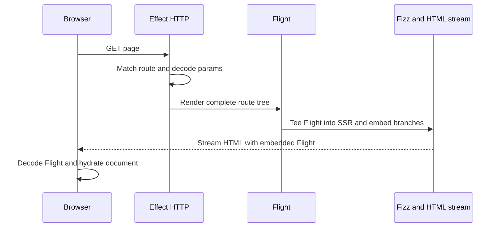
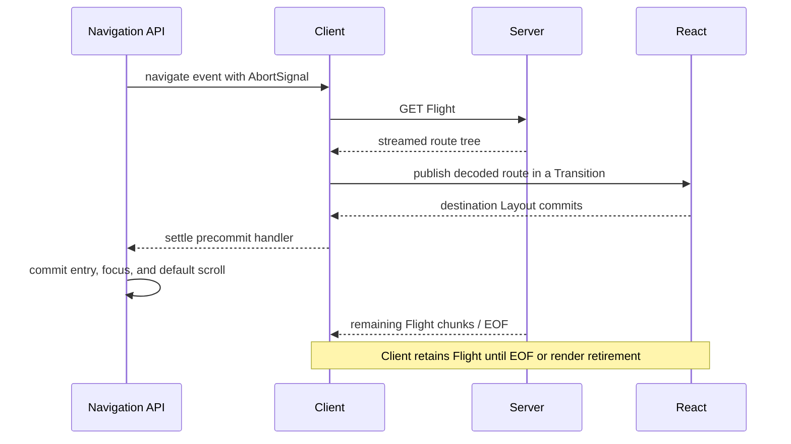

# Request flows

## Initial document

The browser makes no second initial Flight request. It hydrates `document`, not a framework
container. Closing the response cancels both stream branches and interrupts request Effects.

## Client navigation

The precommit promise resolves at the destination Layout commit. The Navigation API can then commit
the URL and history entry, apply focus and default scroll, and let React finish its View Transition
without waiting for Flight EOF. Ownership of a still-streaming response transfers from the native
event signal to the client router at that boundary.

Back/forward navigation may reuse a settled route tree by navigation-entry key. Fresh push/replace
navigations fetch new Flight even when their URL is cached. An unsettled superseded entry is not a
completed cache hit. A superseding candidate leaves the current route visible until its replacement
commits. Cancellation before commit needs no rollback because neither URL nor UI has committed;
postcommit Flight failures go through React's error handling rather than history rollback.

## Server Function

Hydrated calls use React's native Server Function POST. ERSC requires an Origin whose host matches
the application host, enforces the body limit, decodes the reference and Schema input, runs the
handler Effect, and starts the route refresh independently. The response carries the Server Function
result and refreshed Flight through React's native protocol, allowing the result to settle without
waiting for suspended route content.

Hydrated invocations may execute concurrently. Only the latest invocation may apply its embedded
route tree while its original history entry remains current and no navigation is active. Other
responses trigger a fresh current-route refresh. Applying an embedded tree interrupts any older
current-route refresh first.

Progressive form submission uses the same native protocol and returns a redirect to the current
route. The browser then performs an ordinary document request.

Middleware captured by the Server Function surrounds its handler. Middleware already active for the
Server Function is omitted from the refresh; the rest of the current route scope surrounds refreshed
rendering.

## Owners

- [`client/navigation-api.ts`](../../packages/effective-rsc/src/client/navigation-api.ts)
- [`client/client-router.ts`](../../packages/effective-rsc/src/client/client-router.ts)
- [`server/server-fn-request.ts`](../../packages/effective-rsc/src/server/server-fn-request.ts)
- [`server/application.ts`](../../packages/effective-rsc/src/server/application.ts)
