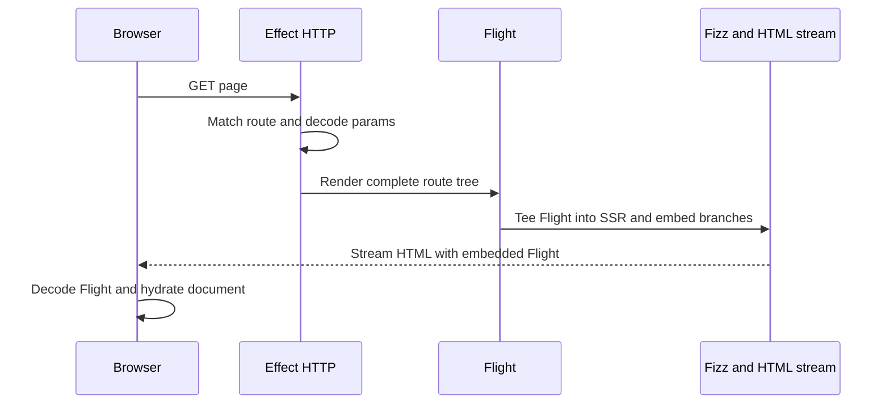

# Request flows

## Initial document

There is no second initial Flight request. SSR uses React DOM `preinit` for compiler stylesheets;
it adds no server-only siblings that could change `useId` paths. Hydration targets `document` and
installs Server Functions even without client-navigation APIs. Without JavaScript, native forms
use progressive submission.

GET/HEAD validates Page parameters before rendering, including beneath Loading. Existing route
middleware services are available to the decoder. Schema rejection returns an empty `404`;
defects and interruption retain their own failure paths. Closing the response cancels both Flight
branches and request render Effects.

## Client navigation

The Navigation API supplies the destination and abort signal. ERSC loads a whole-tree Flight
response and publishes it in a React Transition. At the first UI commit it settles native precommit
work, allowing URL/history, focus, and default scroll to advance. The router retains remaining Flight
until EOF or renderer-confirmed retirement.

The current route remains visible while a candidate prepares. Precommit cancellation discards that
candidate before releasing its stream; postcommit failures use React's error handling. Completed
payloads are cached for their exact history-entry id. Push, replace, and uncached traversal fetch
fresh content. A non-Flight or non-success response falls back to document navigation; a rejected
Page parameter therefore yields `404` on the document request too. Flight redirects use the final
response URL.

The [client-router contract](client-router.md) owns the state machine, cache, transitions, and races.

## Server Function requests

| Mode                   | Request                                   | Flight model / response             | Route refresh |
| ---------------------- | ----------------------------------------- | ----------------------------------- | ------------- |
| Hydrated mutation      | `POST` to current route with reference id | Result, route tree, form state      | Yes           |
| Progressive form       | Native form `POST`                        | Complete HTML with React form state | Yes           |
| Query or stream helper | `QUERY /_ersc/query` with reference id    | Result only                         | No            |

All paths validate Origin and enforce the server body limit before invocation. Hydrated mutation
and query paths share React argument decoding, Schema validation, native references, and temporary
references. The decoded positional envelope must be an array; malformed protocol input returns a
typed `400` before application invocation. Queries require the reference-id header.

### Mutations

The handler runs before refreshed rendering begins. Its result and the route tree share one native
Flight response, so the result can settle before suspended route content. POST parameter decoding
stays inside Page rendering; rejection does not replace a completed function result with `404`.

Hydrated mutations execute concurrently. Only the latest invocation may apply its response tree
while its original history entry remains current and no navigation is active. Other completions
trigger a fresh current-route refresh. Before applying an embedded tree, interrupt older refresh
preparation, await cleanup, and recheck applicability.

React's action reactions settle before ERSC publishes the refresh Transition. Its callback must not
return a Promise waiting for its own commit. Published refresh responses remain owned through EOF
and commit, or renderer-confirmed retirement. Completed response publication invalidates traversal
caches even when the function returned a failure outcome.

Progressive forms use React `decodeAction` and `decodeFormState` and return the refreshed document
without a redirect or second GET. Schema rejection returns `400`; unhandled handler failures retain
the HTTP error path. Client-created bound arguments do not progressively enhance (L004).

### Queries and streams

Client helpers append a private query marker carrying an AbortSignal to the native reference call.
The installed React callback removes it before `encodeReply` and selects `QUERY /_ersc/query`.
This is a separate HTTP mode using React's existing encoding and Flight transport.

Only Server Function middleware surrounds execution and result rendering. Returned React nodes use
the same request render runtime and services. No Page is matched, route tree rendered, traversal
cache invalidated, or mutation ordering counter advanced.

The callback settles the result Promise once the Flight result model is available and retains the
response in the browser runtime until EOF or interruption. `query` owns pending invocation through
its Effect's abort signal; `stream` retains a signal through consumption and full response completion.
The private metadata distinguishes `Query` from `Stream`; only `Stream` carries a required completion
Deferred, settled by the callback after response cleanup. After normal returned-stream EOF, the
adapter awaits that completion interruptibly; failures and early termination cancel the request.
Atom helpers supersede their previous run. Resolving a plain query can precede completion of nested
Flight content; its completed Effect no longer owns that remaining work.

A top-level Effect Stream becomes a Web `ReadableStream` before native Flight encoding. React
streams its chunks without a replacement framing protocol. Flight eagerly consumes the producer;
client pulling does not provide end-to-end backpressure. The request
[owns and awaits producer cleanup](lifetimes-and-protocols.md#returned-stream-cleanup).

## Owners

- [`client/server-fn/call-server.ts`](../../packages/effective-rsc/src/client/server-fn/call-server.ts)
- [`client/server-fn/protocol.ts`](../../packages/effective-rsc/src/client/server-fn/protocol.ts)
- [`server/server-fn/mutation.ts`](../../packages/effective-rsc/src/server/server-fn/mutation.ts)
- [`server/server-fn/query.ts`](../../packages/effective-rsc/src/server/server-fn/query.ts)
- [`server/application.ts`](../../packages/effective-rsc/src/server/application.ts)
