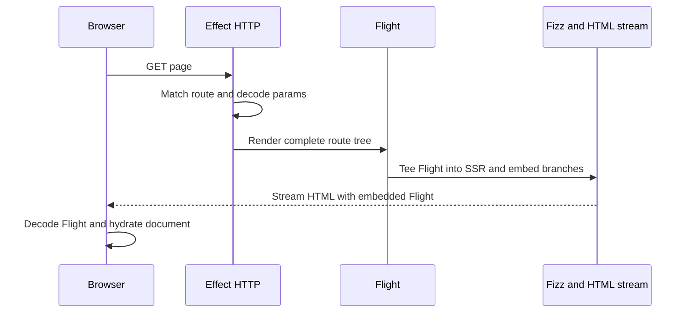
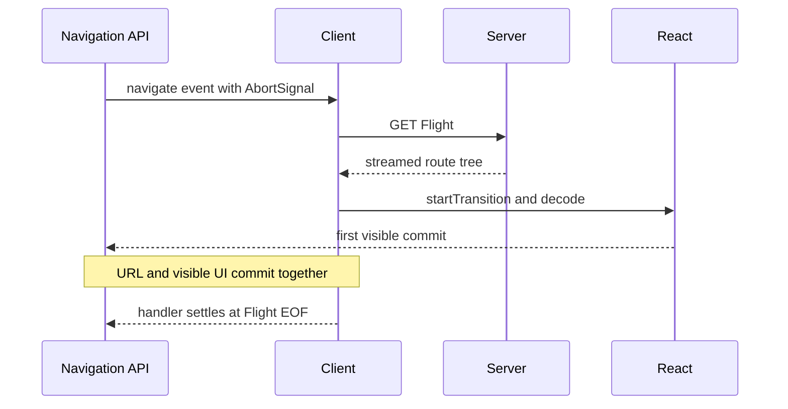

# Request flows

## Initial document

The browser makes no second initial Flight request. It hydrates `document`, not a framework
container. Closing the response cancels both stream branches and interrupts request Effects.

## Client navigation

The precommit promise resolves at React's first visible commit, keeping URL and UI synchronized. The
navigation handler remains pending until Flight EOF, so browser cancellation and supersession still
interrupt the transport and server work.

Back/forward navigation may reuse a settled route tree by navigation-entry key. Fresh push/replace
navigations fetch new Flight even when their URL is cached. An unsettled superseded entry is not a
completed cache hit. Cancellation rolls back URL and visible UI; supersession keeps the current UI
until the replacement commits.

## Server Function

Hydrated calls use React's native Server Function POST. ERSC requires an Origin whose host matches
the application host, enforces the body limit, decodes the reference and Schema input, runs the
handler Effect, and starts the route refresh independently. The response carries the Server Function
result and refreshed Flight through React's native protocol, allowing the result to settle without
waiting for suspended route content.

Hydrated invocations may execute concurrently. Only the latest invocation may apply its embedded
route tree while its original history entry remains current and no navigation is active. Other
responses trigger a fresh current-route refresh. Applying an embedded tree interrupts any older
current-route refresh first.

Progressive form submission uses the same native protocol and returns a redirect to the current
route. The browser then performs an ordinary document request.

Middleware captured by the Server Function surrounds its handler. Middleware already active for the
Server Function is omitted from the refresh; the rest of the current route scope surrounds refreshed
rendering.

## Owners

- [`client/navigation-api.ts`](../../packages/effective-rsc/src/client/navigation-api.ts)
- [`client/navigation-coordinator.ts`](../../packages/effective-rsc/src/client/navigation-coordinator.ts)
- [`server/server-fn-request.ts`](../../packages/effective-rsc/src/server/server-fn-request.ts)
- [`server/application.ts`](../../packages/effective-rsc/src/server/application.ts)
